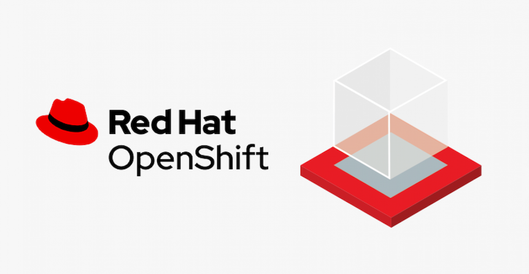

# OpenShift Cloud-Native Application Developer Advocacy Workshop

## Gitbook

[Gitbook here](https://rhthsa.github.io/openshift-workshop/)

## Main Labs
- [Deploy application to openshift with s2i](deploywiths2i.md)
- [Basic Openshift Topology](openshifttopology.md)
- [Scaling up your application in order to handle workload](scale.md)
- [OOTB Application Monitoring, Alert & User workload monitoring](monitor.md)
- [Complex Cloud-Native Application with Live Flight Track Demo](liveflight.md)

## Optional labs
- [App Configuration](evconfigsecret.md)
- [App Health check](apphealth.md)
- [Viewing and working with logs generated by your application](logging.md)
- [Basic Container Storage](storage.md)
- [Serverless](serverless.md)

